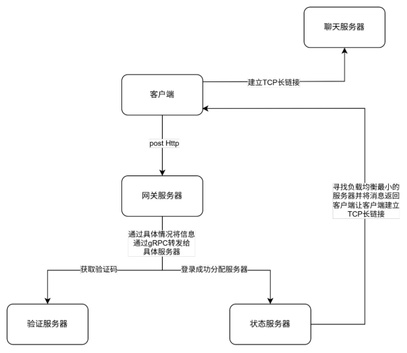
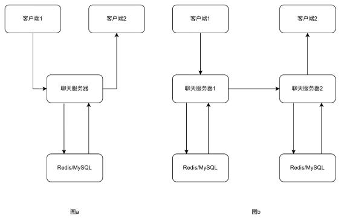

# 系统简介

本系统采用 C/S 架构，基于 Boost.Asio 和 gRPC 构建了一个支持分布式部署的聊天平台，实现了登录注册、密码重置、消息收发、好友搜索、好友推荐、申请与验证等核心功能。

为保障多服务间的数据一致性，引入 Redis 原子操作统一管理用户状态，结合任务队列、互斥锁与条件变量机制避免并发冲突。客户端与聊天服务器之间通过异步 TCP 长连接通信，采用 `shared_from_this()` 管理生命周期，支持断线自动重连；服务间通信使用 gRPC，结合连接状态监控与 KeepAlive 实现稳定可靠的重连机制。

用户登录时，客户端通过网关服务器进行 HTTP 请求，状态服务器负责分配聊天服务器并设置 Token，客户端随后建立 TCP 长连接。注册与重置密码过程中，验证码经验证服务器通过邮箱发送，并存入 Redis 以供校验。

跨服务器通信时，通过 Redis 查询目标用户位置，若在同一聊天服务器直接通信，若在不同服务器则通过 gRPC 中转，确保消息可靠送达。

  

